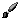
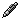
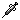

# Pixel V

## Drawing application for pixel art

Visit here: https://pixelvee.netlify.app/

## Concept

The goal of this drawing app is to combine a vector art workflow with a typical
raster art workflow. This app especially makes drawing pixellated curves and
ellipses very easy. Lines made with vector tools can also be modified at any
time, even on the same layer as rasterized pixels. The aim is to make a faster,
smoother workflow for pixel artists.

This app is a work in progress. See the bottom of this page for features that
are planned to be added in the future.

## Functions

<table>
  <tr>
    <td colspan="2"> Undo/Redo </td>
  </tr>
  <tr>
    <td width="66" height="52">  </td>
    <td> Actions that make a change to the canvas can be undone and redone. Only affects actions which are non-reversible. Things like changing canvas dimensions, layer opacity, etc. are inherently reversible so do not qualify to be part of the undo functionality.</td>
  </tr>
  <tr>
    <td colspan="2"> Color Picker </td>
  </tr>
  <tr>
    <td width="66" height="52">  </td>
    <td> Primary and secondary color swatches can be clicked to open a color picker. The color picker uses an HSL gradient selector. Individual color channels and hex codes can also be typed in directly. </td>
  </tr>
  <tr>
    <td colspan="2"> Zoom </td>
  </tr>
  <tr>
    <td width="66" height="52">   </td>
    <td> Zoom with buttons or with the mouse's scrollwheel. </td>
  </tr>
  <tr>
    <td colspan="2"> Recenter </td>
  </tr>
  <tr>
    <td width="66" height="52">  </td>
    <td> Press Recenter to bring the canvas back to normal size and starting position. </td>
  </tr>
  <tr>
    <td colspan="2"> Clear </td>
  </tr>
  <tr>
    <td width="66" height="52">  </td>
    <td> Clears the current canvas layer and removes any vectors on that layer. </td>
  </tr>
</table>

## Tools

<table>
  <tr>
    <td colspan="2"> Brush (B) </td>
  </tr>
  <tr>
    <td width="66" height="52">  </td>
    <td> Draws pixels where your pointer goes. </td>
  </tr>
  <tr>
    <td colspan="2"> Fill (F) </td>
  </tr>
  <tr>
    <td width="66" height="52" valign="middle">  </td>
    <td> Fill contiguous areas of color. This is a vector tool so the position and color can be adjusted at any time. </td>
  </tr>
  <tr>
    <td colspan="2"> Curve (V) </td>
  </tr>
  <tr>
    <td width="66" height="52" valign="middle">  </td>
    <td>
      Draw pixel-perfect lines and bezier curves. The curve type is selected via mode toggles:
      <ul>
        <li><strong>Line (/)</strong> — straight line between two endpoints.</li>
        <li><strong>Quadratic Curve (Q)</strong> — bezier curve with one control point (3 clicks total).</li>
        <li><strong>Cubic Curve (C)</strong> — bezier curve with two control points (4 clicks total). Connected vectors can be linked for smooth continuity.</li>
      </ul>
      All curve types are vector tools — control points and color can be adjusted at any time.
    </td>
  </tr>
  <tr>
    <td colspan="2"> Ellipse (O) </td>
  </tr>
  <tr>
    <td width="66" height="52" valign="middle">  </td>
    <td> Draws an ellipse. Click to place the center, then drag to set the first radius. Hold Shift to force a circle. Both radii and angle can be adjusted separately after drawing. Subpixel center offset can be adjusted to control how the center pixel behaves. This is a vector tool so control points and color can be adjusted at any time. </td>
  </tr>
  <tr>
    <td colspan="2"> Polygon (P) </td>
  </tr>
  <tr>
    <td width="66" height="52" valign="middle">  </td>
    <td> Draws a quadrilateral by placing four corner points. Hold Shift to force a square. This is a vector tool so control points and color can be adjusted at any time. </td>
  </tr>
  <tr>
    <td colspan="2"> Select (S) </td>
  </tr>
  <tr>
    <td width="66" height="52" valign="middle">  </td>
    <td> Select a rectangular area. Restricts other tools to only draw inside the selection. Can be cut or copied via the Edit menu. The selection can be adjusted via 8 control points or moved by clicking inside it while Select is active. </td>
  </tr>
  <tr>
    <td colspan="2"> Magic Wand (W) </td>
  </tr>
  <tr>
    <td width="66" height="52" valign="middle">  </td>
    <td> Select pixels by color. Click to select a contiguous region of matching color. Hold Shift to add to the existing selection; hold Alt to subtract from it. </td>
  </tr>
  <tr>
    <td colspan="2"> Eyedropper (Hold Alt) </td>
  </tr>
  <tr>
    <td width="66" height="52" valign="middle">  </td>
    <td> Pick a color from the canvas. Hold Alt with any drawing tool to temporarily activate the eyedropper. </td>
  </tr>
  <tr>
    <td colspan="2"> Grab (Hold Space) </td>
  </tr>
  <tr>
    <td width="66" height="52" valign="middle">  </td>
    <td> Pan the canvas view freely. Hold Space with any tool to temporarily activate grab. </td>
  </tr>
  <tr>
    <td colspan="2"> Move </td>
  </tr>
  <tr>
    <td width="66" height="52" valign="middle">  </td>
    <td> Move the current layer relative to other layers. </td>
  </tr>
</table>

## Brush

<table>
  <tr>
    <td colspan="2"> Brush Type </td>
  </tr>
  <tr>
    <td colspan="2"> Click the brush preview to cycle between circle, square, and custom stamp brush types. </td>
  </tr>
  <tr>
    <td colspan="2"> Brush Size </td>
  </tr>
  <tr>
    <td colspan="2"> Adjust brush size using the slider (1–32 pixels diameter). </td>
  </tr>
  <tr>
    <td colspan="2"> Custom Stamp Brush </td>
  </tr>
  <tr>
    <td colspan="2"> Draw a custom shape in the stamp editor to use as a brush. The stamp is applied directionally as the pointer moves. </td>
  </tr>
  <tr>
    <td colspan="2"> Dither Pattern </td>
  </tr>
  <tr>
    <td colspan="2"> Choose from 65 dither patterns, applied as a tiled overlay on brush strokes. The dither tile offset (X and Y) can be adjusted to control pattern alignment. </td>
  </tr>
</table>

## Brush Modes

<table>
  <tr>
    <td colspan="2"> Erase (E) </td>
  </tr>
  <tr>
    <td width="66" height="52">  </td>
    <td> Erase instead of draw. Available across multiple tools (e.g. Erase with Fill, Erase with Curve). </td>
  </tr>
  <tr>
    <td colspan="2"> Perfect (Y) </td>
  </tr>
  <tr>
    <td width="66" height="52">  </td>
    <td> Perfect pixel mode for the brush tool. Produces smooth pixel-perfect lines even when drawing slowly. </td>
  </tr>
  <tr>
    <td colspan="2"> Inject (I) </td>
  </tr>
  <tr>
    <td width="66" height="52">  </td>
    <td> Translucent colors are applied directly to the canvas instead of being composited on top of existing colors. </td>
  </tr>
  <tr>
    <td colspan="2"> Color Mask (M) </td>
  </tr>
  <tr>
    <td width="66" height="52" valign="middle">  </td>
    <td> Only draws on pixels that match the secondary color (e.g. if the secondary swatch is red, only red pixels will be painted over). </td>
  </tr>
  <tr>
    <td colspan="2"> Two-Color </td>
  </tr>
  <tr>
    <td width="66" height="52" valign="middle">  </td>
    <td colspan="2"> Uses the dither pattern to blend between the primary and secondary colors. </td>
  </tr>
  <tr>
    <td colspan="2"> Build-Up Dither </td>
  </tr>
  <tr>
    <td width="66" height="52" valign="middle">  </td>
    <td colspan="2"> Dither density increases with each overlapping stroke. </td>
  </tr>
</table>

## Palette

<table>
  <tr>
    <td colspan="2"> Primary / Secondary Swatches </td>
  </tr>
  <tr>
    <td width="66" height="52">  </td>
    <td> Click a swatch to open the color picker. Press (R) to randomize the primary color. </td>
  </tr>
  <tr>
    <td colspan="2"> Switch Primary / Secondary </td>
  </tr>
  <tr>
    <td width="66" height="52">  </td>
    <td> Click to swap the primary and secondary swatch colors. </td>
  </tr>
  <tr>
    <td colspan="2"> Palette Knife (Hold K or click the selected color) </td>
  </tr>
  <tr>
    <td width="66" height="52">  </td>
    <td> Edit a palette swatch. Click the knife, then click a swatch to open the color picker for that color. </td>
  </tr>
  <tr>
    <td colspan="2"> Palette Scraper (Hold X) </td>
  </tr>
  <tr>
    <td width="66" height="52" valign="middle">  </td>
    <td> Remove a palette swatch. Click the scraper, then click a swatch to remove it. </td>
  </tr>
  <tr>
    <td colspan="2"> Add Color to Palette </td>
  </tr>
  <tr>
    <td width="66" height="52">  </td>
    <td> Click to open the color picker and add the selected color to the palette. </td>
  </tr>
</table>

## Layers

<table>
  <tr>
    <td colspan="2"> Add Raster Layer </td>
  </tr>
  <tr>
    <td width="66" height="52">  </td>
    <td> Add a new layer for drawing. </td>
  </tr>
  <tr>
    <td colspan="2"> Add Reference Layer </td>
  </tr>
  <tr>
    <td width="66" height="52" valign="middle">  </td>
    <td> Add a non-editable background image layer for use as a tracing reference. </td>
  </tr>
  <tr>
    <td colspan="2"> Remove Layer </td>
  </tr>
  <tr>
    <td width="66" height="52">  </td>
    <td> Click the trash icon to remove the selected layer. </td>
  </tr>
  <tr>
    <td colspan="2"> Toggle Layer Visibility </td>
  </tr>
  <tr>
    <td width="66" height="52">  </td>
    <td> Click the eye icon to hide or show the layer. </td>
  </tr>
  <tr>
    <td colspan="2"> Layer Settings </td>
  </tr>
  <tr>
    <td width="66" height="52">  </td>
    <td> Click the gear icon to open layer settings. The layer's name and opacity can be changed here. </td>
  </tr>
  <tr>
    <td colspan="2"> Change Layer Order </td>
  </tr>
  <tr>
    <td colspan="2"> Drag a layer to reposition it in the layer stack. </td>
  </tr>
</table>

## Vectors

A panel lists all vectors in the order they were drawn, newest at the top. The
thumbnail reflects the vector's placement on the canvas.

<table>
  <tr>
    <td colspan="2"> Select Vector </td>
  </tr>
  <tr>
    <td colspan="2"> Click a vector in the panel to select or deselect it. Selecting a vector switches the active tool to match it and shows its control points on the canvas. </td>
  </tr>
  <tr>
    <td colspan="2"> Vector Settings </td>
  </tr>
  <tr>
    <td width="66" height="52">  </td>
    <td> Click the gear icon to open per-vector settings: primary color, secondary color, dither pattern, dither offset, brush size, and mode toggles (eraser, inject, two-color, etc.). </td>
  </tr>
  <tr>
    <td colspan="2"> Toggle Vector Visibility </td>
  </tr>
  <tr>
    <td width="66" height="52">  </td>
    <td> Click the eye icon to hide or show the vector. </td>
  </tr>
  <tr>
    <td colspan="2"> Remove Vector </td>
  </tr>
  <tr>
    <td width="66" height="52">  </td>
    <td> Click the trash icon to remove the vector. </td>
  </tr>
</table>

## Curve Tool Options

Options specific to the Curve tool for controlling how connected vectors
interact:

<table>
  <tr>
    <td colspan="2"> Chain (7) </td>
  </tr>
  <tr>
    <td colspan="2"> Start a new vector from a colliding endpoint instead of adjusting it. </td>
  </tr>
  <tr>
    <td colspan="2"> Link (L) </td>
  </tr>
  <tr>
    <td colspan="2"> Connected control points of other vectors move with the selected point (positional continuity). </td>
  </tr>
  <tr>
    <td colspan="2"> Align (A) </td>
  </tr>
  <tr>
    <td colspan="2"> Moves the opposing handle to the opposite angle for smooth tangential continuity. </td>
  </tr>
  <tr>
    <td colspan="2"> Equal (=) </td>
  </tr>
  <tr>
    <td colspan="2"> Enforces equal handle lengths on linked vectors (magnitude continuity). </td>
  </tr>
  <tr>
    <td colspan="2"> Hold (H) </td>
  </tr>
  <tr>
    <td colspan="2"> Maintains the relative angles of all handles attached to the selected control point. </td>
  </tr>
  <tr>
    <td colspan="2"> Display Paths </td>
  </tr>
  <tr>
    <td colspan="2"> Toggle the display of vector paths on the canvas. </td>
  </tr>
</table>

## File Menu

<table>
  <tr>
    <td colspan="2"> Open </td>
  </tr>
  <tr>
    <td colspan="2"> Open a saved <code>.pxv</code> drawing file from your computer. Supports save file versions 1.0, 1.1, and 1.2 with automatic migration. </td>
  </tr>
  <tr>
    <td colspan="2"> Save As... (Cmd + S) </td>
  </tr>
  <tr>
    <td colspan="2"> Download the current drawing as a <code>.pxv</code> file. Save options include whether to preserve history, include the palette, include reference layers, and include removed actions. </td>
  </tr>
  <tr>
    <td colspan="2"> Import </td>
  </tr>
  <tr>
    <td colspan="2"> Import an image into the current layer. </td>
  </tr>
  <tr>
    <td colspan="2"> Export </td>
  </tr>
  <tr>
    <td colspan="2"> Download the drawing as a <code>.png</code> file. </td>
  </tr>
</table>

## Edit Menu

<table>
  <tr>
    <td colspan="2"> Resize Canvas... </td>
  </tr>
  <tr>
    <td colspan="2"> Open a dialog to change the canvas dimensions (8–1024 pixels). An overlay lets you drag to reposition existing art within the new bounds before confirming. </td>
  </tr>
  <tr>
    <td colspan="2"> Select All (Cmd + A) </td>
  </tr>
  <tr>
    <td colspan="2"> Select the entire canvas area. </td>
  </tr>
  <tr>
    <td colspan="2"> Deselect (Cmd + D) </td>
  </tr>
  <tr>
    <td colspan="2"> Deselect the current selection. </td>
  </tr>
  <tr>
    <td colspan="2"> Cut (Cmd + X) </td>
  </tr>
  <tr>
    <td colspan="2"> Cut the selected area. </td>
  </tr>
  <tr>
    <td colspan="2"> Copy (Cmd + C) </td>
  </tr>
  <tr>
    <td colspan="2"> Copy the selected area. </td>
  </tr>
  <tr>
    <td colspan="2"> Paste (Cmd + V) </td>
  </tr>
  <tr>
    <td colspan="2"> Paste the copied selection. The pasted content can be moved and transformed before confirming with Enter. </td>
  </tr>
  <tr>
    <td colspan="2"> Flip Horizontal (Cmd + F) </td>
  </tr>
  <tr>
    <td colspan="2"> Flip the pasted selection horizontally. </td>
  </tr>
  <tr>
    <td colspan="2"> Flip Vertical (Cmd + Shift + F) </td>
  </tr>
  <tr>
    <td colspan="2"> Flip the pasted selection vertically. </td>
  </tr>
  <tr>
    <td colspan="2"> Rotate (Cmd + R) </td>
  </tr>
  <tr>
    <td colspan="2"> Rotate the pasted selection 90° clockwise. </td>
  </tr>
</table>

##  Settings

<table>
  <tr>
    <td colspan="2"> Tooltips (T) </td>
  </tr>
  <tr>
    <td colspan="2"> Toggle tooltips on or off. Hover over any element to see its tooltip. </td>
  </tr>
  <tr>
    <td colspan="2"> Grid (G) </td>
  </tr>
  <tr>
    <td colspan="2"> Toggle the pixel grid on or off. Only displays at higher zoom levels. </td>
  </tr>
  <tr>
    <td colspan="2"> Subgrid Spacing </td>
  </tr>
  <tr>
    <td colspan="2"> Set the number of pixels between subgrid lines overlaid on the main grid. At a value of 1, no subgrid is rendered. </td>
  </tr>
</table>

## Keyboard Shortcuts

| Key             | Action                                                             |
| --------------- | ------------------------------------------------------------------ |
| B               | Brush                                                              |
| F               | Fill                                                               |
| V               | Curve                                                              |
| /               | Curve — Line mode                                                  |
| Q               | Curve — Quadratic mode                                             |
| C               | Curve — Cubic mode                                                 |
| O               | Ellipse                                                            |
| P               | Polygon                                                            |
| S               | Select                                                             |
| W               | Magic Wand                                                         |
| E               | Toggle Eraser mode                                                 |
| I               | Toggle Inject mode                                                 |
| Y               | Toggle Perfect mode                                                |
| M               | Toggle Color Mask mode                                             |
| G               | Toggle Grid                                                        |
| T               | Toggle Tooltips                                                    |
| R               | Randomize primary color                                            |
| K (hold)        | Palette edit mode                                                  |
| X (hold)        | Palette remove mode                                                |
| Space (hold)    | Grab / pan view                                                    |
| Alt (hold)      | Eyedropper                                                         |
| Shift (hold)    | Constrain (line for Brush, circle for Ellipse, square for Polygon) |
| 7               | Toggle Chain (Curve tool)                                          |
| =               | Toggle Equal (Curve tool)                                          |
| A               | Toggle Align (Curve tool)                                          |
| H               | Toggle Hold (Curve tool)                                           |
| L               | Toggle Link (Curve tool)                                           |
| Cmd + Z         | Undo                                                               |
| Cmd + Shift + Z | Redo                                                               |
| Cmd + S         | Save As                                                            |
| Cmd + A         | Select All                                                         |
| Cmd + D         | Deselect                                                           |
| Cmd + C         | Copy                                                               |
| Cmd + X         | Cut                                                                |
| Cmd + V         | Paste                                                              |
| Cmd + F         | Flip Horizontal                                                    |
| Cmd + Shift + F | Flip Vertical                                                      |
| Cmd + R         | Rotate 90°                                                         |
| Enter           | Confirm paste                                                      |
| Backspace       | Delete selection                                                   |

### Features to be added

- Dedicated Mobile / Tablet UI

### Stretch features

#### Vectors:

- Ability to rasterize vectors and remove them from the vectors interface
- Dithered Gradient Tool
- Smooth curves mode for brush — calculates curvature between points; bonus:
  convert a brush stroke into a series of linked vectors
- Shapes: collections of vectors that can be selected and manipulated together
- "Cut" a vector at any point to subdivide it into two separate curves

#### Raster Tools:

- Mask Tool
- Amorphous selection tool

#### Utility:

- 9-Grid Mode: make repeating patterns for a selected tile area, with options
  for brick repeat and half-drop repeat
- Preview window
- Toggle magnify pointer area for precise placement of pixels: move magnifier on
  canvas and then work in magnified window to place pixels. Useful for any tools
  that use subpixels, and for precise placement of vectors.
- Perspective Tool: Acts as a custom overlay on the canvas with user defined
  vanishing points and adjustable lines. 1-point, 2-point, 3-point, multipoint,
  4-point curvilinear, 5-point curvilinear, isometric

#### Layers:

- Layer Settings: blend mode, duplicate layer

#### Palette:

- Color ramps in color picker, with ability to add an entire ramp to the palette
- Optional palette canvas mode (small canvas with brush/eraser/eyedropper for
  building palettes by hand)

#### Animation:

- Spritesheet options: custom grid to subdivide canvas
- Animation preview, onion skins, per-layer frame rate, export animation

# Development

## System Requirements

- [Node.js](https://nodejs.org/) (v18+)
- [Rust](https://rustup.rs/) (via rustup)
- [wasm-pack](https://rustwasm.github.io/wasm-pack/)

After installing Rust via rustup:

```sh
rustup target add wasm32-unknown-unknown
cargo install wasm-pack
```

## Run locally

1. Run `npm install`
2. Run `npm run dev`

## Scripts

| Command              | Description                          |
| -------------------- | ------------------------------------ |
| `npm run dev`        | Build WASM and start Vite dev server |
| `npm run build`      | Build WASM and bundle for production |
| `npm run build:wasm` | Build WASM only                      |
| `npm run sass`       | Watch and compile SCSS → CSS         |
| `npm run eslint`     | Lint source files (dry run)          |
| `npm run eslintfix`  | Lint and auto-fix source files       |
| `npm test`           | Run tests once                       |
| `npm run test:watch` | Run tests in watch mode              |

## Tech Stack

- Plain Javascript
- Svelte 5
- Vite
- WebAssembly (Rust via wasm-pack)
- HTML5 Canvas API
- SCSS
- Vitest for testing
- ESLint with jsdoc plugin
